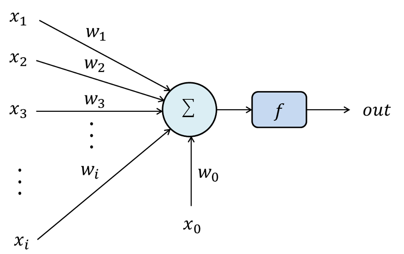

# 모델의 최적화
최적화가 무엇인지 알아보기 전에 기본적인 인공신경망(NN: Neural Network)의 메커니즘을 알아보자. NN은 가중합(weighted sum), 활성화(activation), 오차(loss), 최적화(optimization) 네개의 단계로 설명할 수 있다.
NN은 기본적으로 다층 퍼셉트론 모델(MLP: Multi Layer Perceptron)을 쓰는 경우가 많다. 퍼셉트론이 무엇인지는 아래의 그림을 보자.

위 그림에서 x는 입력값을, w는 가중치를, x0와 w0는 바이어스(편향)값과 그 기울기를 뜻한다. 이때 모든 입력값과 가중치를 곱한 값을 모두 더해준 값을 해당 뉴런의 출력값이라고 한다. 고등학교 수학이 아직 머리에 남아있는 사람들은 뉴런의 출력값(가중합)을 다음과 같이 나타낼 수 있다.

&plus;x_0\cdot&space;w_0)

입력값과 가중치가 곱해진 모양을 보면 두개의 행렬의 곱셈과 유사하다는 사실을 알 수 있다. X를 입력값의 행벡터, W를 가중치의 열벡터라 가정하면 위의 식을 아래처럼 간략히 나타낼 수 있다.

&plus;b)

이때 뉴련의 출력값에 따라 해당 뉴런을 활성화 할지, 비활성화 할지 정하는 단계를 활성화 단계라 한다. 모든 뉴런의 활성화가 끝난 후의 결과값을 해당 층(layer)의 출력이라 하는데 이때의 출력은 모델이 예상한 결과이므로 실제와 차이가 있을 수 있다. 이때 실제 값과의 차이를 오차(loss)라 하며 오차를 구하는 방법에도 여러 종류가 있지만 이 글에서는 생략한다. 오차 계산까지 끝나면 오차를 줄이기 위해 최적화 단계에 들어간다. 이번 글에서는 가장 기본적인 방법인 경사 하강법(Gradient Descent)를 알아보도록 하자.

## Gradient Descent
경사 하강법이 어떤 방법인가를 알아보기 전에 최적화란 무엇일까를 생각해보자. 모델을 최적화 한다는 뜻은 우리가 가지고 있는 모든 데이터를 고려하여 오차가 가장 작은 모델을 만드는 것이다. 그러나 우리가 다루는 데이터는 양이 너무 방대하기 때문에 모든 데이터를 고려한 최적의 방법(전역 최적화:Global optimization)을 찾을 수는 없고 그에 근접한 지역 최적화(Local optimization)를 사용하게 된다. 경사 하강법 또한 지역 최적화 기법의 하나다.

경사 하강법을 이용한 최적의 해를 찾는 방법은 공을 굴려 공이 멈추는 지점을 찾는것과 유사하다. 큰 그릇의 임의의 위치에서 탁구공을 떨어뜨린다고 생각해보자. 이때 공은 그릇의 벽면을 이리저리 움직이며 결국 그릇의 가장 밑바닥에 멈출 것이다. 경사 하강법 또한 마찬가지로 함수의 값을 조금씩 움직여 가며 더이상 움직이지 않을 때까지 반복하는 방법이다.

위의 cost함수를 보자. 빨간 점은 오른쪽으로, 파란점은 왼쪽으로 굴러 떨어질 것이다. 인간은 직관적으로 어느 지점에서 cost가 최소가 되는지를 알 수 있지만 기계가 알아들을 수 있도록 하려면 어떡해야 하는가를 생각해 보자. 
우선 w축의 임의의 점에서 w값과 그 지점에서의 기울기만큼 움직여 보자. 빨간 지점같이 기울기가 음수라면 w가 커져야 하고, 파란 지점같이 기울기가 양수라면 w가 작아져야할 것이다. 이를 하나의 식으로 정리하면,

)

와 같이 될것이다. 이때 감마 값을 학습률(learning rate)이라 하며 이 학습률을 조정하는 것으로 최적화에 걸리는 시간을 조절할 수 있다.