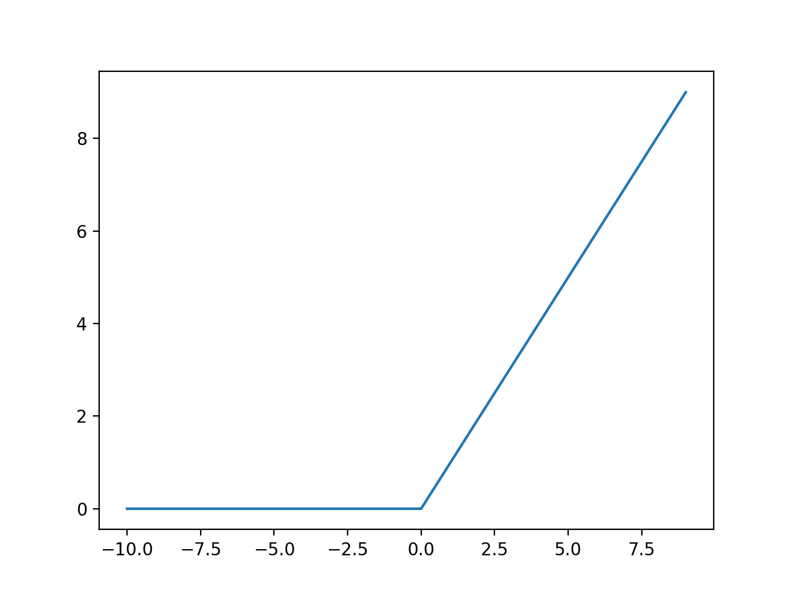

## one-hot 벡터
기계학습은 크게 분류문제, 회귀문제로 나뉜다. 회귀 문제는 2장에서 봤던대로 연속적인 값을 예측하는 문제고, 분류 문제는 입력값이 어떤 정답 레이블에 가장 가까운지를 예측하는 문제이다. 분류는 참 거짓을 판단하는 이진분류(Binary Classification)와 여러개의 레이블 중, 어떤 레이블인지를 판단하는 다항분류(Multinomial Classification)가 있다. 

**이진 분류**

NN의 출력값은 0과1이 아닌 연속적인 실수다. 따라서 분류를 하기 위해서는 출력층에 활성화 함수를 적용해야 한다. 이진분류에서의 활성화 함수는 여러 중류가 있지만 여기서는 가장 기본적인 sigmoid함수를 다룬다.

시그모이드의 특성상 값이 0보다 조금만 커도 1에 매우 가까워 지므로 이진 분류의 활성화함수로 많이 사용된다.

**다항 분류**

시그모이드는 이진분류에는 적합하지만 다항분류에 사용하기에는 적합하지 않다. 따라서 다항분류는 조금 다른 함수를 사용해야한다. Softmax는 각 정답 레이블에 얼마나 일치하는지에 대한 확률을 나타내주는 함수다. 출력층에서의 출력값인 실수를 입력받아 확률로 변환해준다고 생각하면 편하다. 예를 들어 개와 고양이를 분류하는 모델이 있다고 할때, 출력층의 결과가 개:2.0, 고양이:1.5 라는 결과가 나왔다 하자. 

위 함수에 출력층의 결과를 입력하면
개 : S(2.0) = 0.622
고양이: S(1.5) = 0.377
라는 결과를 얻을 수 있다. 이는 개일 확률이 62%, 고양이 일 확률이 37%라는 뜻이다. 소프트맥스의 결과를 벡터로 나타내면 [0.622, 0.377]가 된다.

**one-hot 벡터**

one-hot 벡터는 가장 높은 확룰을 갖는 요소를 1로, 나머지는 0으로 채워진 벡터를 말한다. 소프트 맥스의 결과를 보자. one-hot 변환을 시키면 소프트맥스 벡터가 [1,0] 으로 바뀌게 된다.
정리하자면 소프트 맥스는 여러개의 레이블에 대해 모델의 입력값이 해당 레이블일 확률을 나타내고, one-hot은 소프트 맥스의 최대값만을 남기는 역할을 수행한다.

**Cross Entropy**
분류 문제는 교차 엔트로피(Cross Entropy)를 손실함수로 많이 사용한다. 

> 주의! 교차 엔트로피는 one-hot 인코딩이 된 경우에 한해서 사용할 수 있다.

교차 엔트로피는 다음과 같이 계산한다.

이때 y는 실제 레이블, y'은 네트워크가 예측한 결과값이 된다. 이때 실제 레이블은 one-hot 인코딩이 되어있기 때문에 실제 레이블의 예측값 만을 가지고 계산을 하게 된다. 위의 예를 보자면 softmax가 출력 [0.622, 0.377]를 가질때, 실제레이블(개=1인경우)을 살펴보면 [1,0]이 될것이다. 그렇다면 이때의 교차 엔트로피는 0.47이 된다.로그함수의 특성상 예측결과가 0에 가까워 질수록 오차는 기하급수적으로 커진다. 

## ReLu 활성화

딥러닝에서는 오차역전파를 통해 오차를 줄이는 일이 많다. 

> Tip) 오차역전파는 출력층부터 입력층 까지 역으로 거슬러 올라가며 오차를 줄여나가는 방식

오차 역전파는 미분을 이용하여 오차를 다음 레이어로 넘겨주는데, sigmoid는 값이 0~1 사이의 값을 가지므로 미분을 하면 할수록 값이 작아진다. 따라서 출력층에서 멀어질수록 오차 수정이 되지 않는다. 이를 해결하기 위해 나온 함수가 ReLu 함수다. ReLu 함수는 단순하게 0보다 작을 때는 0, 그보다 클 때는 값을 그대로 갖는 함수다.

