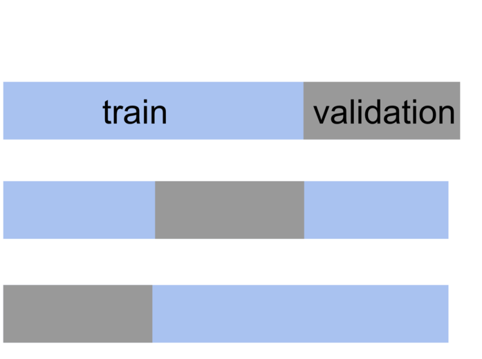
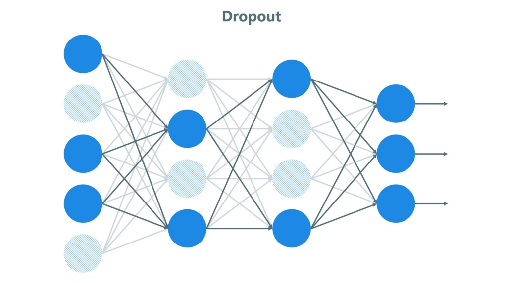

# 학습을 더 효과적으로

이번 절에서는 학습을 조금더 정확하고 빠르게 할 수 있는 방법에 대해 소개하고자 한다.

## Validation

우리는 모델의 성능을 평가할 때, 가지고 있는 데이터를 할용해야 한다. 보통은 전체 데이터의 20%정도를 test 데이터로 나두고, 나머지를 학습용 데이터(training data)로 사용하는 경우가 많다. 여기서는 모델의 성능평가를 위한 방법 몇가지를 소개한다.

### Cross Validation

교차검증(Cross Validation)은 데이터의 일부분을 검증용 데이터로 남기고 학습을 진행하는 것을 말한다. 

위 그림처럼 데이터의 일부분을 검증용 데이터로 남기고 학습을 진행한다. 이때 데이터의 한 부분만을 남기는 것이 아니라 검증용 데이터를 바꿔가며 여러번 학습한 뒤, 정확도의 평균치를 모델의 성능으로 사용하는 방법이다.

### Leave One Out Validation

LOO는 CV와 유사한 방식이나, 데이터셋 중에서 단 한개의 데이터 만을 검증용 데이터로 사용하는 방법이다. 따라서 데이터의 개수만큼 학습을 진행해야 하며 CV보다는 많은 훈련용 데이터를 챙길 수 있지만, 시간이 오래 걸린다는 단점이 있다.

## Dropout

드롭아웃은 과적합(과학습)을 방지하기 위한 방법이다. 

> Tip) 과학습(Overfitting)은 가지고 있는 데이터셋에 너무 의존하여 모델을 만들어서 검증시, 좋은 결과를 나타내지만 실제의 결과와는 거리가 멀어지는 것을 뜻한다.

드롭아웃은 네트워크의 일부 뉴런을 비활성화 시켜서 학습하는 방법이다.

위 그림에서 연한 색은 비활성화된 뉴련을 가리킨다.

## Batch Normalization

NN 모델에서 한 레이어의 출력은 다른 레이어의 입력이 된다. 학습 과정에서 오차를 줄이기 위해 가중치를 바꾸다 보면 활성화 되는 뉴런역시 바뀌게 될 것이다. 이렇게 되면 은닉층 레이어들의 입력분포가 변하게 되므로 학습에 악영향을 끼친다. Batch Normalization은 이런 현상을 방지하기 위해 각 레이어의 출력을 정규화 해준다. 모든 레이어들의 입력은 정규화된 입력을 받게 되므로 학습이 안정해지고 그에 따라 학습률을 크게 설정하는 것이 가능하기 때문에 학습 속도 또한 빨라진다.