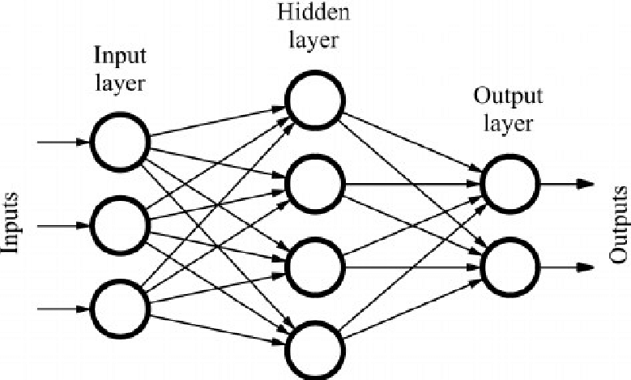

# Kears 기초

Keras는 tf상에서 존재하는 추상화된 API이다. 이번 장에서는 Keras의 Sequential API와 Functional API를 Feedforward Network를 통해 알아보도록 하자

## Feedforward Network

2장에서 우리는 MLP모델을 보았다. MLP는 입력층에서 다음층으로 출력값을 넘기며 그 출력값이 되돌아 오는 일은 없다. 이처럼 값이 되돌아오는 일(Feedback)이 없는 네트워크를 Feedforward Network라고 부른다.

위의 그림을 보면 입력값은 입력층(Input Layer)에 들어가고, 입력층의 결과는 은닉층(Hidden Layer)에 들어가며, 은닉층의 결과는 출력층(Output Layer)에 들어간다. 입력층과 출력층을 제외한 모든 층을 은닉층이라 부르는데, 은닉층에서 벌어지는 일을 우리가 굳이 알 필요가 없기에 이런 이름이 붙혀졌다. 이때 하나의 뉴런이 이전 층의 모든 뉴런과 연결된 상태를 Fully Connected됐다 하며 이런 형태의 네트워크를 Fully Connected Network라 한다.

>Tip) 하나의 층이 Fully Connected된 경우는 Fully Connected Layer라 부름

## Sequential API

케라스의 sequential api는  Sequential클래스의 add메소드를 이용해 차례대로 모델에 레이어를 추가하는 방식으로 동작한다. 레이어의 추가가 완료되어 모델의 정의가 끝나면 compile메소드를 이용해 최적화 방법, 오차함수, 평가 지표 등을 정하게 된다. 아래의 의사코드를 통해 대략적인 개발 과정을 알아보자.

	model = Sequential()
	model.add(Layer)
	model.compile(optimizer='optimizer', loss='loss funxtion', metrics=accuracy)
	
## Fuctional API

functional api는 Sequential클래스에 레이어를 추가하는 방법이 아닌, 이전의 출력값을 직접 레이어의 인자로 넣어주는 방식이다. 모델의 형태를 함수의 인자로 넘기는 식으로 정의하고, 마지막으로 Model클래스의 입력층과 출력층을 넣어준 후, compile메소드와  fit메소드를 통해 학습을 진행한다. 아래의 의사코드를 보자.

	input = Input()
	hidden = Layer()(input)
	output = Layer()(hidden)
	model = Model(inputs=[input], output=[output])
	model.compile()
	model.fit()
	
## 이번에 사용될 코드

1. 분류 : classification
2. 학습을 더 효과적으로 : core features