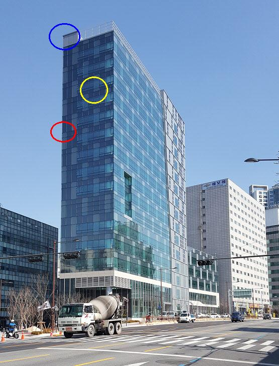
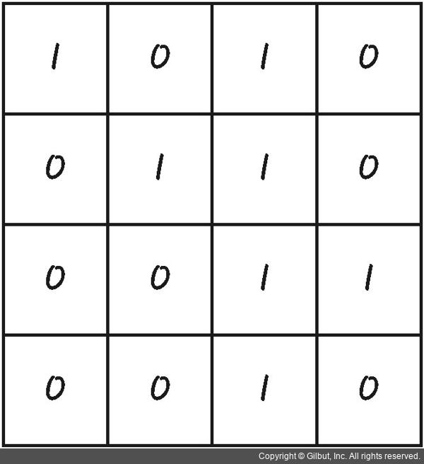
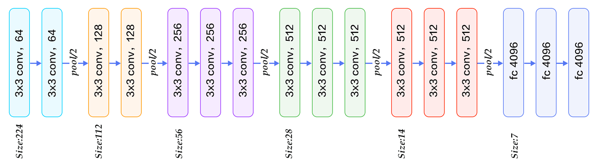

# CNN(Convolutional Neural Network)

우리가 앞서 배웠던 MLP모델은 이미지 처리에 적합하지 않다. 이미지의 위치 정보를 잃어버리기 때문이다. 이런 단점을 보완하기 위해서 이미지 고유의 특징을 추출하여 학습하는 방식인 CNN이 등장했다. CNN은 이미지의 특징을 추출한 다음 Fully Connected Layer를 이용한 분류기를 통해 입력된 이미지가 어떤 것인가를 추측한다.

## 특징 추출(Feature Extraction)

특징 추출은 이미지 처리에서 빼놓을 수 없는 핵심 기술이다. 아래 그림을 보자

우리가 노란 부분만 떼놓고 봤을 때, 그것이 빌딩의 어느 부분인지 추측할 수 있을까? 비슷한 부분이 너무 많아서 위치를 특정하기에 노란 부분은 적합하지 않다. 빨간 부분을 봐도 건물의 건물의 끝부분임을 알 수는 있지만 위치를 특정하기에 정보가 충분하지는 않다. 그러나 파란 부분을 보면 우리는 건물의 어느 부분인지 확실하게 구분할 수 있다. 이처럼 이미지를 구분하기에 충분한 정보를 가진 것을 특징이라고 하며, 이 특징을 구분하기 위해서 커널(필터)을 이용해 convolution을 하게 된다. 

## Convolution

우리가 가진 이미지가 다음과 같다고 하자

아래와 같은 3X3필터가 있다고 할때,
-1 | -1 | -1
-1 | 8 | -1
-1 | -1 | -1
 이 필터를 이용해 이미지 전체를 스캔하여 컨볼루션을 진행한다. 왼쪽 위부터 차례대로 스캔해 보자. 컨볼루션은 겹치는 픽셀끼리 곱하고, 필터의 모든 픽셀을 더해주면 된다. 왼쪽 위를 한다고 하면 (1*-1)+(0*-1)+(1*-1)+(0*-1)+(1*8)+(1*-1)+(0*-1)+(0*-1)+(1*-1)=4 가 되는 것이다. 이런 과정을 하는 이유가 도대체 뭘까? 우리의 필터를 다시 보자. 필터 안의 숫자를 모두 더하면 0이되는 것을 쉽게 알 수 있다. 위 건물 사진의 노란 부분에 이 필너를 씌워보자. 노란 부분의 색은 특별히 변하는 부분없이 비슷한 색을 갖는다. 따라서 이 필터를 노란부분에 씌우면 컨볼루션의 결과는 0에 가까운 숫자가 될 것이다. 반대로 빨간 부분에 씌우면 건물과 하늘의 경계를 제외하면 0에 가까운 값을 갖게 될것이다. 컨볼루션의 결과값을 새로운 이미지의 픽셀값이라 가정하면(0이면 흰색) 건물과 하늘의 경계만 까만 선으로 나타나고 나머지 부분은 하얗게 나타나는 새로운 이미지가 생성될 것이다. 이처럼 필터를 잘 설계하는 것으로 이미지의 특징을 추출할 수 있다. 
 
## Pooling

이미지를 학습할때 특징은 많으면 많을 수록 좋을까? 그렇게 생각하기 쉽지만 사실은 그렇지 않다. 너무 많고 정확한 특징만을 갖고있다면 우리 모델은 과적합에 빠지기 쉽다. 따라서 CNN은 풀링 레이어를 설정해서 추출한 특징들의 정보를 일부 버리는 과정을 진행한다. 풀링은 Max Pooling, Average Pooling등 다양한 방법이 있지만 여기서는 가장 간단한 Max Pooling을 설명하도록 하겠다. 

Max Pooling은 필터를 씌우고 그 안에서 가장 큰 값 만을 남기는 방식이다. 컨볼루션의 결과가 아래와 같다고 하자.
1 | 1 | 2 | 4 
5 | 6 | 7 | 8 
3 | 2 | 1 | 0
1 | 2 | 3 | 4

이때 2X2크기의 필터를 2칸씩 움직여서 풀링을 하면
6 | 8
3 | 4
가 된다. 풀링을 하게 되면 이미지의 사이즈가 필연적으로 줄어들게 된다. 이때 이미지의 크기를 동일하게 하기 위해 모자란 부분을 0으로 채우기도 한다.

> Tip) 이렇게 0으로 채우는 방법을 Zero Padding이라고 함.

정리하자면 CNN은 컨볼루션 레이어와 풀링레이어를 반복하여 적용한 다음, 마지막으로 Fully Connected Layer를 이용하여 분류를 하는 알고리즘이다.

# Transfer Learning

전이학습(Transfer Learning)이란 한 문제를 풀기위해 얻어진 지식을 비슷한 다른 문제에 적용하기 위한 학습법이다. 예를 들어 개를 인식하는 모델이 고양이도 인식하게 하는 것을 말한다.

잘 학습된 CNN모델에 우리가 준비한 데이터(학습 당시의 데이터와 유사해야함)를 이용해 다시 학습한다면 CNN모델이 우리가 원하는 데이터를 인식하게 할 수 있다. 유사한 방식의 데이터가 추가되므로 모델의 가중치를 그대로 사용할 수 있기 때문에 모델 전체를 다시 학습할 필요는 없다. 우리가 가진 새로운 데이터가 모델을 학습시킬 당시의 데이터 양보다 적다면, 과적합 방지를 위해 마지막 레이어만을 학습시키는 것이 좋다. 만약 학습 당시의 데이터와 비슷한 양의 데이터를 가진 경우에는 모델 전체를 학습시켜야 된다.

이번에는 VGG16모델을 이용하여 전이학습을 직접 구현해 보자.

## VGG16 모델

vgg16모델은 224X224X3크기의 RGB 이미지를 입력으로 받는다. 앞에서 설명했듯이 CNN은 컨볼루션과 풀링을 반복하며 학습하는 모델이다. 가장 왼쪽의 레이어부터 차례대로 살펴보자. 3X3X3 크기의 커널로 컨볼루션을 진행하여 64개의 특징맵을 생성한다(224X224X64 크기의 텐서가 생성됨). 

> 참고) VGG16모델은 padding, convolution stride가 1로, polling stride 가 2로  설정되어 있고, 활성화는 ReLu를 이용함

3X3X64크기의 커널을 이용하여 특징맵을 컨볼루션 해준다. 결과적으로 224X224X64크기의 특징맵이 생성되고 2X2필터를 이용한 Max Pooling을 통해 112X112X64 의 텐서를 남긴다.

128개의 3X3X64커널을 이용해 컨볼루션을 위와 동일한 방식으로 두번 진행, 112X112X128 크기의 특징맵이 만들어지고, 풀링을 통해 56X56X128 크기의 텐서가 결과로 남는다.

256개의 3X3X128 크기의 커널로 컨볼루션을 세번 진행해 56X56X256 크기의 특징맵이 만들어지고, 풀링을 통해 28X28X256 크기의 텐서가 결과로 남는다.

512개의 3X3X256 크기의 커널을 이용해 컨볼루션을 세번 진행해 28X28X512 크기의 특징맵을 만들고 풀링을 통해 14X14X512 크기의 텐서가 결과로 남는다.

512개의 3X3X512 크기의 커널을 이용해 컨볼루션을 세번 진행해 14X14X512 크기의 특징맵을 만들고 풀링을 통해 7X7X512 크기의 텐서가 남는다.

7X7X512 크기의 텐서를 1차원 벡터로 변환해서 4096개의 뉴런으로 구성된 Fully Connected 레이어를 통과시킨 후, 마지막으로 1000개의 뉴런을 갖는 출력층을 통해 예측 결과를 내보낸다.

VGG16은 커널의 크기를 축소시켜서 훈련시켜애 할 파라미터의 개수를 작게 할 수 있다는 장점이 있다. 이는 학습의 속도가 빨리진다는 뜻이고, 층이 깊어짐으로써 많은 특징을 추출할 수 있다는 장점이 있다.