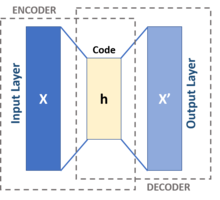
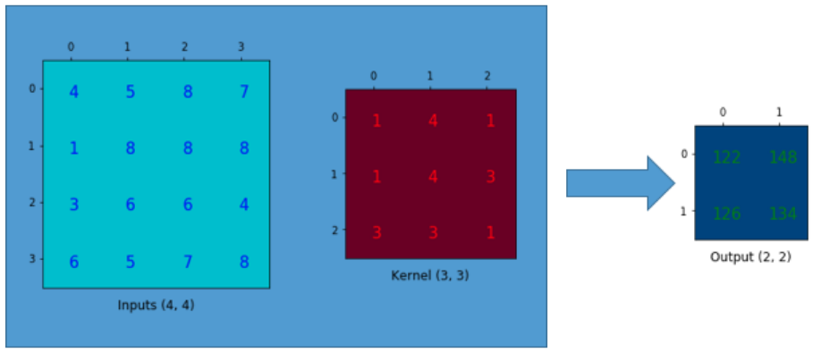
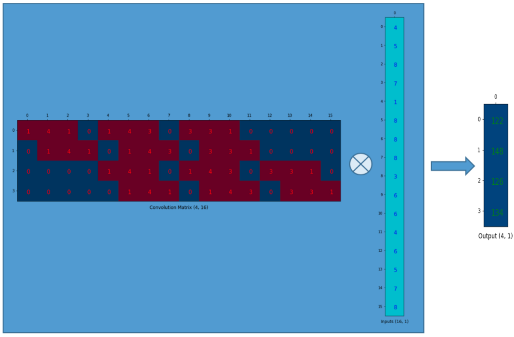

# CAE를 이용한 노이즈 제거
우리가 이미지를 처리하는데 있어서 노이즈는 반드시 존재하기 마련이다. 노이즈는 학습을 방해하는 요소이기 때문에 적으면 적을수록 좋다. 이번에는 CAE(Convolutional AutoEncoder)를 가지고 노이즈를 제가하는 방법에 대해 알아보자.

## AutoEncoders

오토인코더는 Feed Forward 네트워크의 한 종류로, 출력과 입력이 동일한 네트워크를 말한다. 

AE(오토인코더)는 입력 데이터를 더 작은 차원으로 압축해주는 인코더(Encoder), 인코더에 의해 축소된 데이터인 코드(Code), 압축된 데이터를 원본 데이터로 복원시켜주는 디코더(Decoder) 세개의 구성요소로 이루어져 있다. 처리하는 결과로 레이블이 필요없다는 점에서 AE는 비지도 학습의 일종이다. 인코더를 데이터의 코드로의 사상으로, 디코더를 코드의 데이터로의 사상으로 정의하면 AE는 다음과 같이 정의할 수 있다.

처음 보는 기호가 나왔다고 당황하지 말자. 첫번째 수식은 사상 파이(함수에서의 1대1 대응과 비슷한 뜻)는 X에서 F로 사상시킨다는 뜻이고, 두번째 프사이는 F에서 X로 사상한다는 의미다. 마지막 식은 AE는 원본 X와 인코딩 디코딩을 마친 X의 차이의 제곱이 가장 작아지는 사상 파이와 프사이를 채택한다는 뜻이다.

조금더 구체적으로 들여다 보자. 인코더가 입력 x를 코드 h로 사상한다고 하자.

이때 W,b,시그마는 각각 인코더의 파라미터인 가중치 행렬, 바이어스 벡터, 활성화 함수를 말한다. 디코더는 아래와 같이 표현할 수 있다.

오토인코더의 오차는 입력과 출력의 제곱오차를 사용하여 아래와 같이 표현한다.

위 손실함수는 x'를 x에관해 풀어쓰면 간단히 얻어질 수 있다.

## Denoising AEs

DAE는 입력으로 노이즈가 낀 입력을 받고, 원본과 유사하게 학습하는 알고리즘이다. 원본데이터 x와 노이즈가 첨가된 데이터 x'이 있을때, 위의 과정과 동일하게 학습한다. 

DAE의 장점은 데이터에 노이즈가 첨가되어 있어도 어느정도 복구할 수 있기 때문에 학습이 좀더 강인한 학습이 가능해진다는 점이다.

## Convolutional AEs

기존의 AE는 모두 Fully Connected 레이어를 사용했기 때문에 2차원의 이미제 데이터의 위치정보를 잃어버린다는 단점이 있었다. 2차원 데이터를 다루는데 Fully Connected 레이어보다는 CNN이 성능이 좋다는 사실은 널리 알려진 사실이다. CAE는 인코더를 CNN과 동일하게 convolution 층과 pooling층으로 구성하여 이미지를 압축하여 중간층 z를 만들고, 디코더는 convolution층과 up-sampling층을 이용하여 중간층 z를 복원한다.

인코더의 k-번째 특징맵은 다음과 같이 얻을 수 있다.

이때 *는 곱셈이 아닌, 콘벌루션이다. 디코더의 복원 작업도 AE와 비슷하게 이루어진다.

디코더는 인코더에 의해 얻어진 특징맵들을 입력으로 하여 이미지 복원을 한다. 복원 과정에대해 이해하기 전에 콘벌루션이 무엇인지 다시한번 짚고 넘어가자. 콘벌루션이 필터가 이미지를 훑고 지나가는 개념이라는 정도는 알고있을것이다. 여기서 선형대수가 중요한 이유가 나오는데 콘벌루션은 사실 두 행렬의 곱셈으로 나타낼 수 있다. 아래 그림을 보자.

위와 같은 커널을 가지고 콘벌루션을 하고 싶을때 우리는 커널을 이리저리 움직이며 output 행렬을 얻을 수 있다. 그러나 커널 행렬을 잘 조작하는것으로 콘벌루션을 간단하게 나타낼 수 있다.

위 4X16 행렬은 4X4이미지의 콘벌루션을 완벽하게 나타내고 있다. 이해가 잘 되지 않는다면 아래 그림을 보자.

콘벌루션 대상인 4X4 이미지를 flatten시켜 16X1 열벡터로 변환하고, convolution matrix와 행렬곱을 하는것으로 4X1 열벡터를 만들어 낸다. 이 열벡터를 다시 2X2 행렬로 변환해주면 콘벌루션이 완성되는 것이다.

다시 디코더의 복원작업으로 돌아오자. 우리는 이제 행렬의 곱셈으로 콘벌루션이 이루어 진다는 사실을 알고있다. 그렇다면 4X16 행렬을 전치시켜 transposed convolution matrix를 만들어 16X4 행렬을 만들고, 콘벌루션의 결과인 4X1(물론 2X2를 flatten 시킨 행렬)행렬을 곱한다면, 우리는 4X4(16X1 행렬을 변환)크기의 행렬을 얻을 수 있다. 이는 콘벌루션의 결과를 역산하는 deconvolution이 아니라 up-sampling의 일종이므로 혼동하지 말자. 
이번에 적용할 up-sampling 방법은 지정한 행, 열 만큼 같은 값을 반복해 재나열하는 방식을 채택한다.

정리하자면, CAE의 인코더는 CNN과 마찬가지로 콘벌루션과 풀링을 통해 이미지를 압축하고, 디코더는 콘벌루션과 업샘플링을 통해 이미지를 복원하는 것이다.